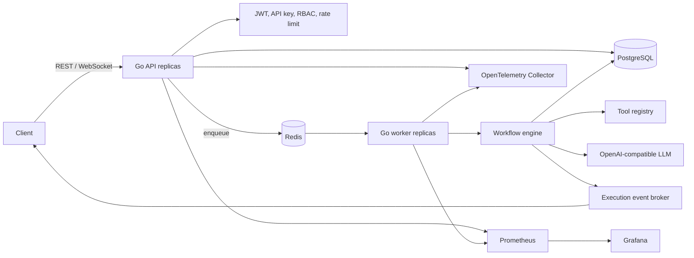

# AgentFlow architecture

## Runtime topology

## Component boundaries

- `internal/app`: use cases, validation, idempotency, and queue dispatch.
- `internal/domain`: stable entities shared across adapters.
- `internal/store`: persistence contracts plus in-memory and PostgreSQL adapters.
- `internal/queue`: in-process and Redis-backed job queues.
- `internal/worker`: bounded concurrent job consumers.
- `internal/workflow`: multi-step LLM/tool execution, timeout, retry, circuit breaker, traces, metrics, and events.
- `internal/llm`: provider-neutral contract and OpenAI-compatible adapter. Gemini can be used through a compatible endpoint or a new adapter.
- `internal/tool`: replaceable tool interface and thread-safe registry.
- `internal/httpapi`: Gin REST and WebSocket transport.
- `internal/observability`: Prometheus collectors and OTLP trace setup.

## Execution lifecycle

1. The API authenticates and authorizes the caller.
2. `POST /agents/{id}/execute` validates the request and checks the idempotency key.
3. A queued execution is persisted before a compact job is pushed to Redis.
4. One worker claims the job and loads the immutable agent version context.
5. The engine calls the LLM with bounded retries and a deadline.
6. Requested tools execute concurrently, each with its own deadline and trace step.
7. Tool outputs return to the LLM until a final answer or the step limit is reached.
8. Every state change is persisted and emitted as a live event.
9. Metrics and OTLP spans carry execution, agent, model, and tool attributes.

## Reliability model

- PostgreSQL is the source of truth; Redis queue payloads contain identifiers only.
- Idempotency is enforced per owner by a unique database constraint.
- Context cancellation propagates through workers, LLM requests, tools, and storage calls.
- Exponential backoff includes jitter and is bounded by attempt count and delay.
- The LLM circuit breaker opens after repeated failures and resets after a cooldown.
- Worker concurrency is explicit and independently scalable from API replicas.
- Graceful shutdown stops intake, cancels workers, drains HTTP requests, and flushes traces.

## Security model

- JWTs must use HS256, include `sub` and `exp`, and may include an RBAC `role`.
- API keys are compared in constant time. Production deployments should resolve hashed keys from the `api_keys` table instead of using the bootstrap key.
- Data access is owner-scoped in service and persistence methods.
- Kubernetes workloads run as non-root with a read-only root filesystem and dropped capabilities.
- Secrets are injected at runtime and never committed.
